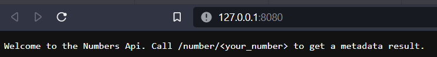
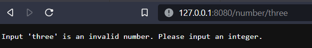
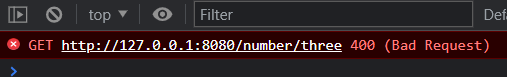

## Numbers API

Provides metadata about a number that is provided as input.

#### Usage
Default endpoint will return the following:

If you pass a number between 1 and 7 (first day of week being Sunday):

If you pass an invalid number:

Http Response Code:

