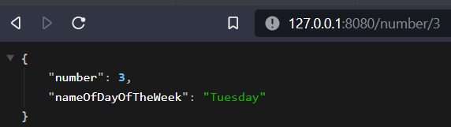
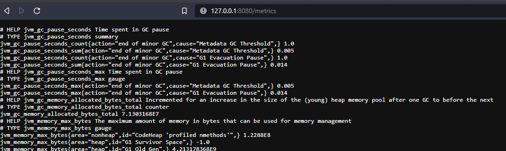

# Numbers API

Provides metadata about a number that is provided as input. The api is created in Kotlin using the IntelliJ IDEA IDE.

### Development setup
IntelliJ IDEA will automatically download dependencies, thus it is recommended that you use this IDE. Had issues with new dependencies added to build script not reflecting immediately, restart the IDE helped with this.

### Usage
Default endpoint will return the following:  

**Request headers**  

Request header `X-Request-Id` may be included. This will be generated automatically if it is excluded. This header is
is returned as part of the response.

---

If you pass a number between 1 and 7 (first day of week being Sunday):  

---

If you pass an invalid number:  

Http Response Code:  

---

### Metrics
To view the metrics visit `/metrics`

